# OpenCV Image Filter Studio

An interactive image filtering tool built with OpenCV and ipywidgets — apply artistic, edge, and colour filters to any image directly in Google Colab.

---

## Filters available

| Category | Filters |
|----------|---------|
| Basic | Grayscale, Blur, Sharpen |
| Edge based | Canny Edge, Sobel Edge |
| Artistic | Cartoonify, Pencil Sketch, Emboss, Sepia |
| Colour | Warm Tone, Cool Tone, Invert |
| Portrait | Background Blur |

---

## How to use

1. Click the **Open in Colab** badge above
2. Run all cells
3. Click **Upload Image** to upload any image
4. Select a filter from the dropdown
5. Click **Apply Filter** to see the result
6. Click **Download Result** to save the filtered image

> No API keys or installations needed — runs entirely in Google Colab

---

## Results

### Grayscale
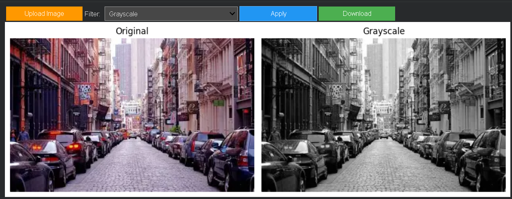

### Blur
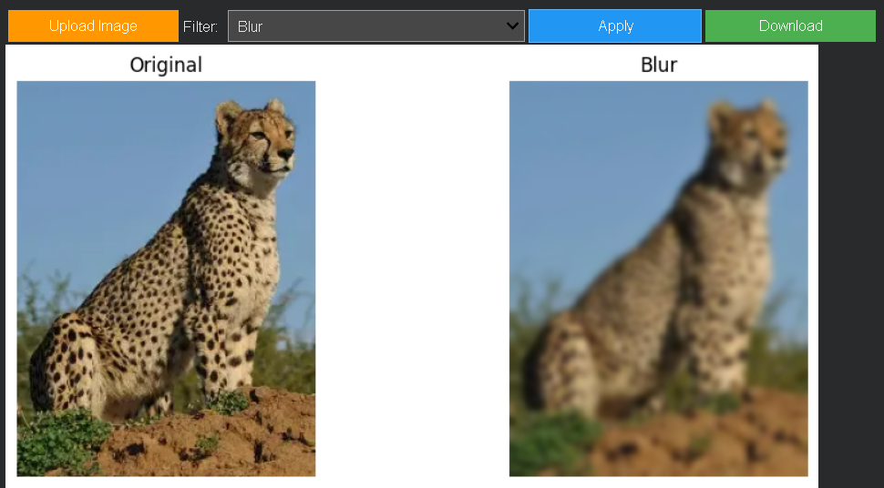

### Sharpen
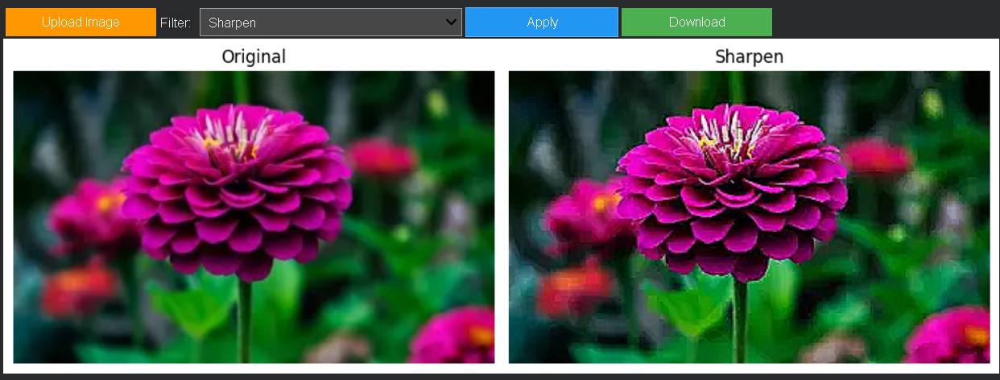

### Canny Edge
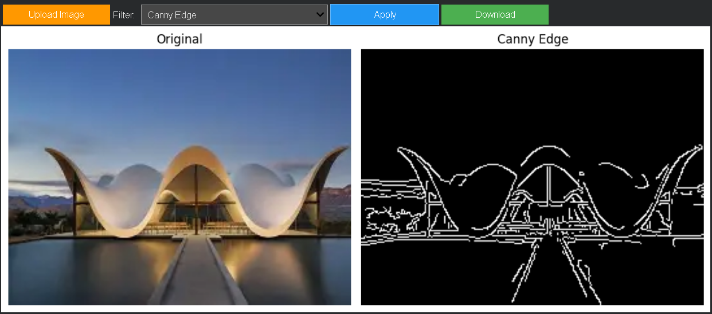

### Sobel Edge
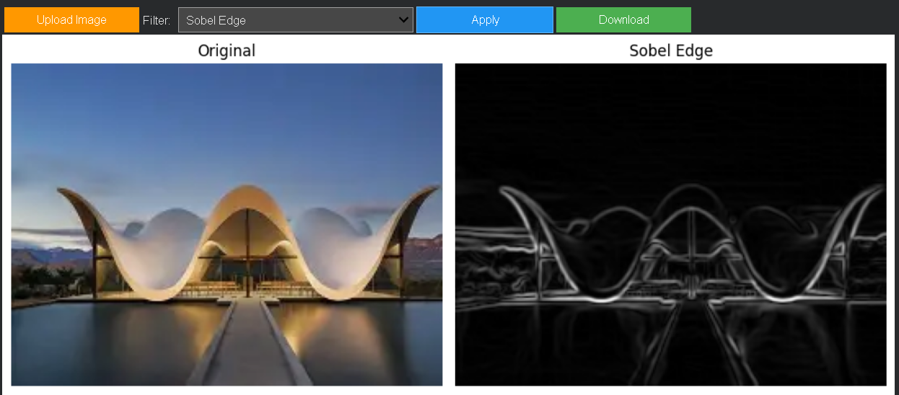

### Cartoonify
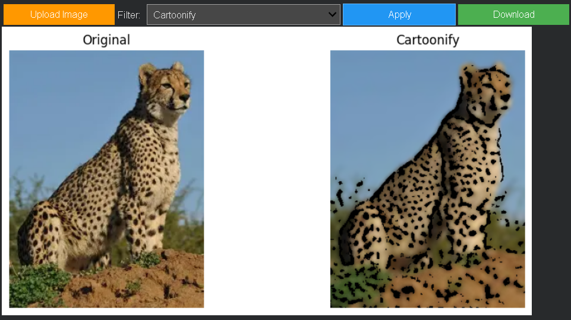

### Pencil Sketch
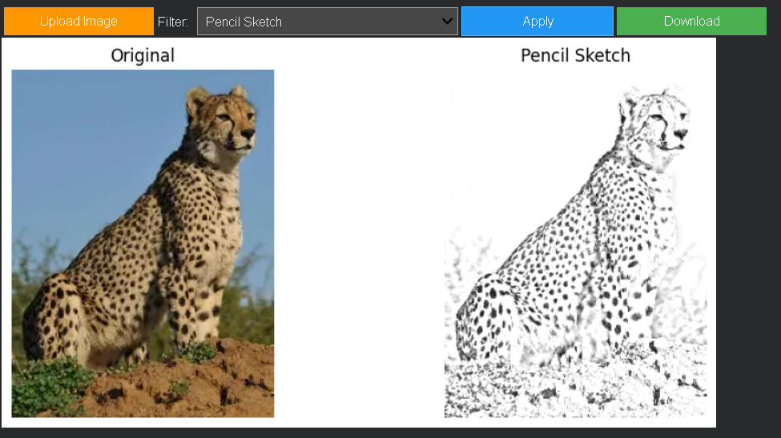

### Emboss
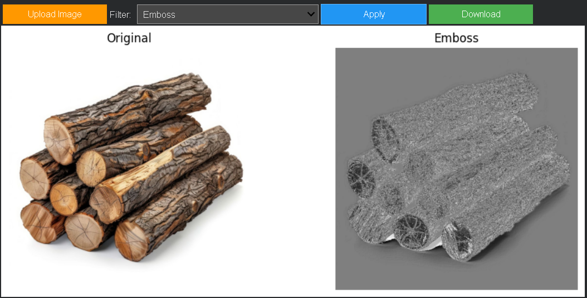

### Sepia
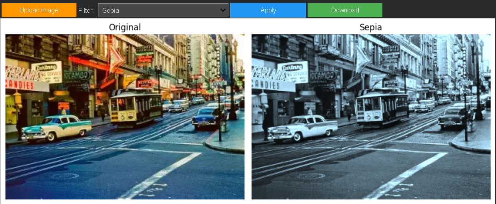

### Warm Tone
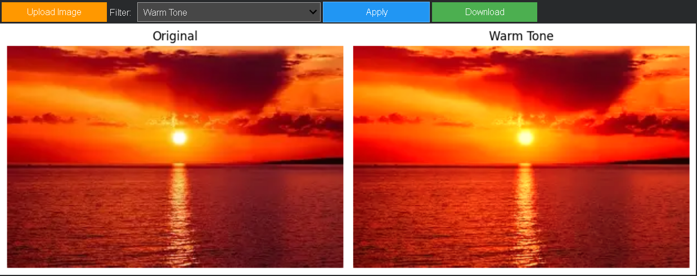

### Cool Tone
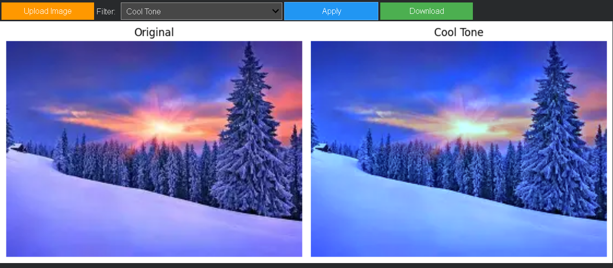

### Invert
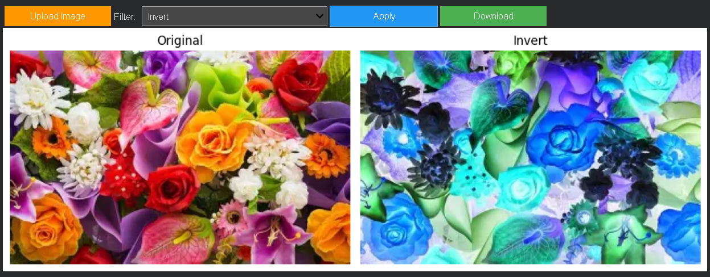

### Background Blur
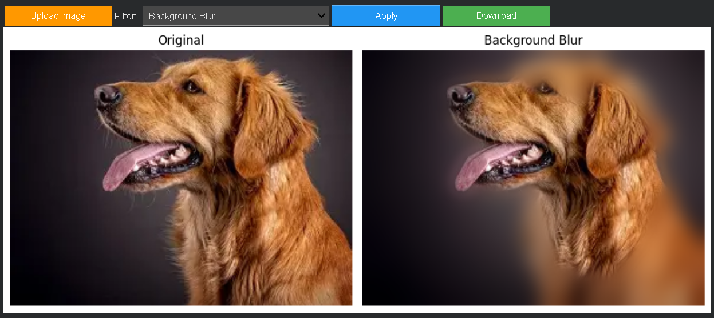

---

## How each filter works

| Filter | How it works |
|--------|-------------|
| Grayscale | Converts RGB to single channel using weighted average (0.299R + 0.587G + 0.114B) |
| Blur | Replaces each pixel with weighted average of neighbors using Gaussian kernel |
| Sharpen | Amplifies center pixel and subtracts neighbors using convolution kernel |
| Canny Edge | Detects edges using gradient thresholding with double threshold (100, 200) |
| Sobel Edge | Measures gradient in x and y directions separately, combines with sqrt(x²+y²) |
| Cartoonify | Bilateral filter for smooth colors + adaptive threshold for cartoon outline |
| Pencil Sketch | Dodge blend between grayscale and inverted blurred image |
| Emboss | Asymmetric kernel creates light/shadow effect simulating raised surface |
| Sepia | 3x3 matrix multiplication on RGB channels replicating vintage photograph look |
| Warm Tone | Boosts red channel, reduces blue channel |
| Cool Tone | Reduces red channel, boosts blue channel |
| Invert | Flips every pixel value (255 - value) |
| Background Blur | GrabCut foreground segmentation + Gaussian blur on background only |

---

## Requirements
All dependencies install automatically in the notebook:
- opencv-python-headless
- ipywidgets
- numpy
- matplotlib

---

## Tags
[opencv](https://github.com/topics/opencv) [image-processing](https://github.com/topics/image-processing) [python](https://github.com/topics/python) [colab](https://github.com/topics/colab) [ipywidgets](https://github.com/topics/ipywidgets)
